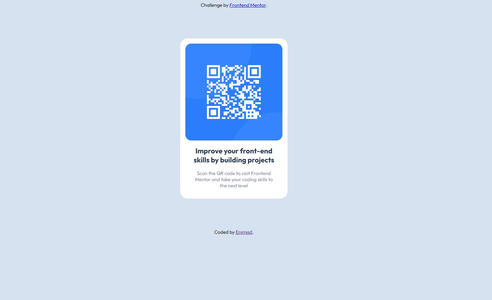

# Frontend Mentor - QR code component

## Table of contents

- [Overview](#overview)
  - [Screenshot](#screenshot)
  - [Links](#links)
- [My process](#my-process)
  - [Built with](#built-with)

## Overview

The challenge is to build out a QR code component (based on an image) and get it looking as close to the template as possible.

### Screenshot

### Links

- Solution URL: https://github.com/enimad/QR-Code-Component
- Live Site URL: https://enimad.github.io/QR-Code-Component/

## My process

HTML:
- I added the link to the google font
- I changed the tags and added the img

CSS:
- I created all the styling in order to get as close as possible to the template

### Built with

- Semantic HTML5 markup
- CSS custom properties
- Flexbox
